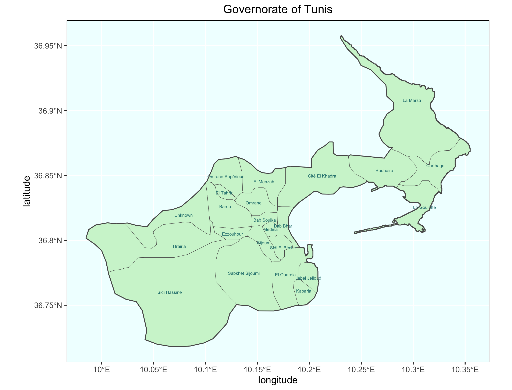

# Final Project: Tunisia
## Administrative Map of Tunisia
  Tunisia is the smallest country in North Africa, bordered by Algeria in the west, Libya in the southeast, and by the Mediterranean Sea in the east and north. It is divided into 24 governorates, which are futher divided into delegations.

## Population Distribution in Tunisia

The most populous governorate is Tunis, which contains the nation's capital city of the same name. Despite occupying only around 0.2% of the area of Tunisia, 10.7% of the nation's population lives in the governorate of Tunis. The second most populous governorate is Sfax. Most of the population is located in the northern half of the country because of the Mediterranean Sea coastline in the northeast and the Sahara desert in the south.

## Population by delegation

## Raoued

Raoued is a delegation in the northeast of Tunisia, part of the governorate of Ariana. It borders the Gulf of Tunis and is only about 11km from Tunisia's capital city. 

The main roads in Raoued mostly go through the main urban areas. The road in the lower left corner represented by the dark blue line is a highway that leads to the capital city of Tunis to the South. The reason the urban area by this highway is the most population dense is most likely because of its easy access to the capital.

Each red cross represents a pharmacy. 

It is clear how topography affected development in Raoued with the way the urban areas surround the mountains, but don't extend into them. Roads were built through valleys in the mountain.
[Interactive 3dplot](https://theresareese.github.io/workshop/interactive3d)

